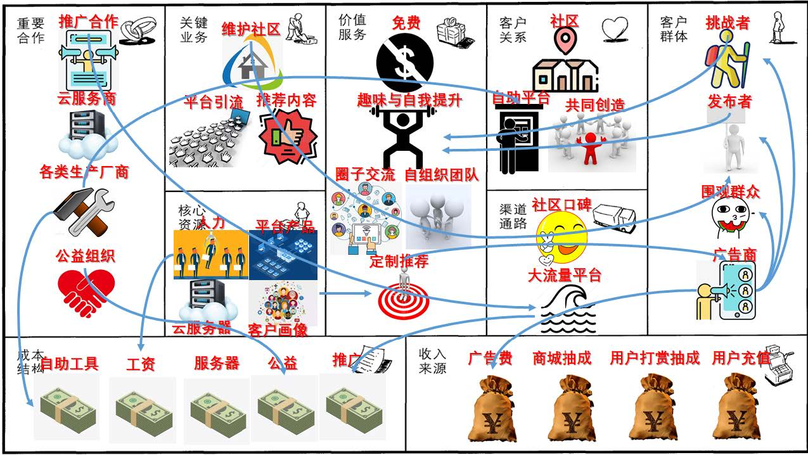
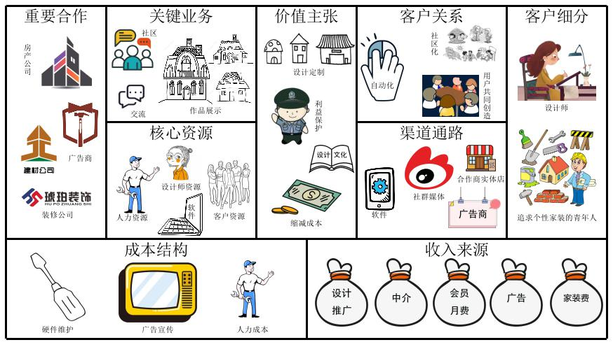

<h1 align ="center">商业模式设计</h1>

[TOC]

## 1. 文档信息

### 1.1 项目题目

“啥梗——互联网冲浪指南”

### 1.2 组员信息

| 姓名   | 学号      |
| ------ | --------- |
| 张卓楠 | 181830249 |
| 刘学卓 | 181250088 |
| 陈子合 | 181250019 |
| 梁鋆亮 | 181250081 |

### 1.3 工作概要

*需要一段简介来描述本阶段工作的概要与内容框架，六种设计方法的产物作为本文档的六个章节逐一描述*

*本次作业需要体现出细致的产品设计，不可泛泛而谈*

*六个设计方法的产物在内容上要一致，六个章节之间需要通过文字描述进行逻辑上的起承转合*

*文档排版清晰整洁，行文流畅可读性强，满足度量数值的要求；*

### 1.4 度量数值

- 客户洞察：
  - 3个
- 构思：
  - 5个
- 模型构建：
  - *【更新的画布内总要点数量不少于30 个，关联关系不少于15 个，引用的调研报告和新闻报道不少于10 篇】*
- 讲故事：
  - 4个
- 场景：
  - 6个

## 2. 客户洞察

*客户洞察：至少两个典型客户群体的移情图（实践中一般为3到5 个）与相关分析说明，需要包含客户针对产品的看、听、想与感受、说与做、痛点、收益六个部分*

*客户视角是商业模式设计的指导性原则。客户的观点决定了我们选择怎样的价值主张、渠道、客户关系和收入来源。所以，让我们走进客户的内心世界，看一下我们客户真正需要什么*

### 2.1 客户视角-1

追逐潮流的年轻人，希望能及时赶上热词热梗

【客户移情图】

- 看
- 听
- 想与感受
- 说与做
- 痛点
- 收益

### 2.2 客户视角-2

四十岁以上的中老年人，对于互联网文化中的各种新奇词汇并不熟悉，对于各种电子产品的使用也不是很熟练。

【客户移情图】

- 看： 智能手机这么普遍，家里的孩子都拿着手机刷刷刷，家庭饭桌上的交流似乎变少了，似乎与年轻人有了隔阂
- 听： 总是会听到年轻人嘴里冒出来各种奇怪的词汇，例如套娃，千层饼，芜湖等等。就连央视新闻中都会冒出来打工人，尾款人这样的新鲜词语。向孩子询问后总是会得到不耐烦的回答。
- 想与感受： “前浪”也想跟上时代的潮流，说不定自己了解这些词语后就能和自己的孩子更方便地交流，一家人的相处会更融洽。
- 说与做： 会向自己的孩子提问，也会抱怨如今的搜索引擎自己用起来并不流畅。
- 痛点： 1. 孩子很忙，没时间解释，仅仅就是回答“你自己不会查么？”；2. 有的时候知道词语的意思，但还是不知道怎么正确的语境下使用；3. 有的时候查询一个词语就会引出一连串的词语，挨个查询十分麻烦。
- 收益： 跟上互联网时代的脚步，拥有和年轻人轻松交谈的能力，一个更加和谐融洽温暖的家庭氛围。

### 2.3 客户视角-3

词条的贡献者，请求广场的询问者，小众文化的传播者，希望能贡献一个词的来龙去脉，希望能造梗，玩梗——大司马狂热粉丝

- 看：主播“芜湖大司马”如今在电子游戏圈很火、有人听不懂“大司马”的热词热梗，甚至有人讨厌“大司马”的热词热梗、社会上对游戏主播存在偏见
- 听：年轻朋友喜欢玩“大司马”的热词热梗、不了解“大司马”热词热梗的人对我谈吐中存在的热梗有疑问、长辈反对我对“大司马”的热爱、社会上反对的声音
- 想与感受：希望自己能继续热爱“大司马”、希望别人也可以喜爱“大司马”、希望更多的人了解“大司马”造的热词热梗的含义、希望长辈和社会上反对的声音逐渐消失
- 说与做：科普热词热梗、传播“大司马文化”
- 痛点：对“大司马”的狂热缺乏实际效益、找不到科普和传播热词热梗的渠道
- 收益：收获志同道合的朋友、长辈与社会的认可、“大司马文化”得以传播

## 3. 构思

通过对客户洞察和移情图的分析，我们讨论得到了以下5个商业模式创意

### 3.1 创意一：客户驱动

- 问题
  - 如果用户希望全面地了解某个热词热梗的“前世今生”会怎样？
- 处理方式
  - 可以以专栏形式提供某些高热度梗的来龙去脉以及相关衍生词汇
  - 提供梗的使用实例以及通过定期活动鼓励用户带有相关tag在评论区/论坛区发帖
  - 例如凡尔赛文学专区、无内鬼专区、苏联笑话专区
- 影响
  -  通过动态推送专栏的形式，不断提升平台的热度，增加客户留存率
  - 激发用户的创作潜力，不仅仅是梗收集平台，更是造梗平台，吸引更多新用户，增加客户细分
  - 专栏可通过转载至其他平台的方式，渠道通路加强，高效的宣传推广。

### 3.2 创意二：客户驱动

- 问题
  - 如果用户希望根据不同使用身份需要获取热词热梗会怎样？
- 处理方式
  - 产品功能模块化，可通过功能模块开关设置自定义产品主页面
  - 例如针对游客/非深度用户/长者提供精简页面，便捷地获取特定用户需要的信息。
- 影响
  - 不同用户使用不同模式的产品，依照用户细分提供不同的功能模块，增强客户留存率
  - 与降低沟通、交流、查询成本的价值主张相对应
  - 产品开发成本会有相应的提高

### 3.3 创意三：资源驱动

- 问题
  - 如果用户希望查询热词热梗又不想花费大量时间在互联网查询鉴别会怎样？
- 处理方式
  - 产品收集汇总热词热梗，提供便捷查询热词热梗的平台
  - 除了用户编写上传的词条之外，组织运营团队实时跟进互联网热词热梗，监控网络舆情，及时更新
- 影响
  - 向用户提供热词热梗资源，缩减沟通交流的成本，产品黏性增加
  - 运营团队导致人力资源成本的上涨

### 3.4 创意四：财务驱动

- 问题
  - 如果用户希望完全免费地使用产品会怎样？
- 处理方式
  - 提供免费的基础查询服务，保证产品流量
  - 收集并绘制用户画像，根据用户类型精准投放广告，增加广告推广收入，例如广告词条位置
  - 提供数据资源服务，包括详细的热词热梗发展历史可视化的数据分析项目
  - 提供会员增值服务，产品界面、用户头像、UI包装等会员身份象征
- 影响
  - 免费商业模式，将流量转化为收入
  - 找到新的收入来源，从多源化收益

### 3.5 创意五：多点驱动

- 问题
  - 如果用户希望借助平台了解更多文化圈子会怎样？
- 处理方式
  - 平台定期组织活动：“接梗大赛”、“破圈battle”等，了解其他圈子
  - 多文化、多标签之间的交流融合，吸引不同圈子的词条编写者相互碰撞、多点开花
  - 用户自发“出圈”，模仿热门段子
- 影响
  - 吸引潜在用户，增加客户细分
  - 扩展渠道通路，增加产品知名度
  - 与其他友商合作联动

### 3.6 最终确定的商业模式创意

通过对提出的商业模式创意的讨论和分析，我们最终整合得到如下的最终商业模式创意

- 驱动因素
  - 客户驱动
  - 财务驱动
  - 资源驱动
- 问题
  - 如果用户希望快速搜索热词热梗会怎样？
  - 如果用户希望了解梗的来龙去脉会怎样？
  - 如果用户希望了解实时热梗会怎样？
  - 如果用户希望传播自己所了解的词汇或梗会怎样？
  - 如果用户希望免费使用热词热梗服务会怎样？
- 处理方式
  - 平台提供热词热梗搜索服务，用户可以便捷地搜索词条
  - 平台为热词热梗设置专栏，全面介绍词条的“前世今生”
  - 平台设置热词榜单，为用户提供实时更新的热点
  - 平台组织“玩梗大会”、“年度段子”等活动，提供社交功能和论坛版块，帮助不同圈层破圈融合
  - 平台免费提供热词热梗的基础服务，并通过广告费、数据服务费和增值服务会员费等多种方式获得收益
- 影响
  - 价值主张变动：缩减交流成本、文化圈层交融、便捷易用
  - 客户关系增加：用户自助服务、自动化推荐、客户共同创造
  - 收入来源调整：增值服务、数据分析、广告收入
  - 成本比重变化：产品开发成本、运营团队成本、产品推广成本
  - 商业模式：多边平台商业模式

## 4. 视觉化思考

*视觉化思考：一张视觉化的商业模式画布（参考教材147 页）与相关分析说明，画布应源于一同提交的视觉化讲述商业模式的作业，建议有进一步的改进*

*根据我们选择的商业模式创意，我们构建了我们的商业模式画布。*

【商业模式画布图】——联系可视化展示内容，制作一张新图，并加以说明

参考一：

参考二：

## 5. 模型构建

*模型构建：更新过的商业模式画布与相关分析，需包含粗略的市场潜力预估、画布中各个模块之间的联系、以及支撑画布构建的基本事实（相关调研报告与新闻报道）*

### 5.1 更新的商业模式画布

*更新后的商业模式画布（纯文字版）*

### 5.2 市场潜力预估

*市场环境、商业模式、用户、技术、商业等方面的潜力预估*

### 5.3 模块之间的联系

*参照之前商业模式画布的部分进行补充修改*

#### 5.3.1 相邻模块之间的联系

#### 5.3.2 纵向联系

#### 5.3.3 跨越的联系

#### 5.3.4 联系的联系

### 5.4 基本事实（相关调研报告和新闻报道）

找资料，放链接

## 6. 讲故事

*讲故事：围绕模型构建中的画布编写至少一个源自大作业团队（公司）视角的故事，以及至少两个源自客户视角的故事，故事中需指明与画布中模块的对应关系*

### 6.1 公司视角（产品开发者视角）

### 6.2 用户一视角

**马国保，21岁，希望追随潮流的大学生**

​	马国保是一名软件学院大三学生。平时忙于老师布置的大作业，很少在网络上消遣冲浪，主要的娱乐方式是跟同学聊天，刷空间。但是，最近马国保同学陷入了烦恼：在跟同学聊天时，马国保经常会看不懂他们说的一些名词，无法很好地融入群体。

​	早上起床，马保国刷朋友圈看到高中的老班长脱单了。他本想评论9999，但是发现评论区充斥着：“看到你发pyq 我啪的一下就点进来了。很快啊！”、“年轻人不讲武德”、“年轻人不要搞窝里斗！”、“这好吗？这不好！”、“针不辍，班长npy针不辍”。。。。马保国一时间不知道该评论什么，匆匆点了个赞去上课了。中午，马保国看老乡群里聊天。一位大四学姐A说：“真羡慕你们这些有好多课可以上的人呢，我现在每天都没有起床的动力了，555”。另一位同学B说：”哈哈哈哈学姐真是凡尔赛大师！“A：”哈哈哈我这个技能掌握的还行吧！“马保国心想：好气啊，这个学姐怎么这么装！为啥其他人都不嫌弃她？凡尔赛大师是什么意思？马国保是典型的窥屏选手，虽然他也想在群里发言，但是由于经常看不懂对话，他也不敢乱说话。晚上，舍友洗完澡回来拍了拍马国保：”欸！佐天，我在洗澡签字的表上看到我前一个人名字写的国马保，再前一个人写的马保国，笑死我了！“马国保很疑惑：”怎么了？发生什么事了？是因为他名字跟我很像吗？“他舍友笑了笑说：你去b站上搜一搜马保国，你就知道了。

  晚上睡前，马国保打开b站搜索马保国，出现了一大堆鬼畜视频，马国保随便点了一个。看倒一个69岁的老人右眼发紫，好像是刚被打了。马国保心想，大家为什么都在恶搞这个老人？这好吗？这不好！

### 6.3 用户二视角

**周红霞，48岁，普通工人，同时也是一个18岁女孩的母亲。**

红霞发现女儿在长大后很多事情都不愿意跟自己说了，女儿有了自己的朋友，她们经常说着红霞搞不清楚的句子，女儿经常就是跟朋友发消息，打电话，家里的气氛十分冷淡。

最近红霞听到女儿在跟朋友聊起凡尔赛文学，某天坐在沙发上，为了缓解冰冷的气氛，红霞问女儿最近她很喜欢的凡尔赛文学是什么，要不要一起去书店看看。女儿愣了愣，不知道怎么接话，最后叹气道，“唉，跟你解释不清楚，你去网上查下不就知道了。” 客厅里又陷入了沉默。

红霞跟微信上的姐妹们求助，奈何姐妹们也都不晓得这个凡尔赛文学到底是什么，但是她们向她推荐了一款叫做“啥梗”的手机软件，据说在上面可以查到很多年轻人都在说的新鲜词语。在这款软件上，红霞很方便的查到了女儿最近经常说的凡尔赛文学究竟是什么意思，还发现了软件上竟然还开辟了凡尔赛文学专区，里面好多人都在发些凡尔赛的段子。

红霞不仅知道了凡尔赛文学是什么，而且在浏览的过程中还发现了许多新鲜的东西，比如为什么女儿不喜欢自己在微信上发挥手和微笑的表情。。。

这款软件除了搜索功能外，竟然还有热词榜。红霞现在不仅可以很方便跟女儿聊天，甚至还知道许多女儿不知道的流行词语，她竟然有一天成为了别的孩子嘴里的时尚潮流的妈妈。在其他家长向她询问与女儿交流的成功秘诀时，她十分乐意向他们推荐“啥梗”这款软件。

### 6.4 用户三视角

**古拉加斯(Gragas)，21岁，“芜湖大司马”狂热粉丝（词条贡献者）**

​		古拉加斯是一名大三学生，是英雄联盟游戏爱好者，同时也是游戏主播“芜湖大司马”的狂热粉丝。他从英雄联盟国服刚开服的时候就爱上了这款游戏，并在“大司马“的第一个“鳄鱼教学视频”走红全网后，他就被”大司马“细致的操作和人格魅力所迷住了，他对”芜湖大司马“的这份热爱，一直延续到了今天。

​		可是，随着年龄增长，大司马的操作不再细致。大司马曾经因为没有了王者操作一度陷入低谷，现在也是因为自己的”热词热梗“在网上流传，才得以重新走红。古拉加斯也曾因为喜爱游戏主播而受到长辈的责怪。为了让自己喜爱的主播保持人气并希望得到长辈的认可，古拉加斯希望自己可以传播”大司马文化“，为不熟悉”大司马“的人科普”大司马“的热词热梗，并希望能在自己日常观看”大司马“直播的时候能创造热词热梗，希望可以通过这种方式，在为”大司马“吸引人气的同时，能让自己获得成就感以及长辈和社会的认可。某一天，古拉加斯在微博、抖音、B站、斗鱼等知名平台浏览关于大司马的内容时，看见了一款新的软件产品的广告，主题为热词热梗传播交流与创造，这款产品正在开展一系列活动吸引对高产热词热梗的领域有深入了解的词条贡献者。古拉加斯狂喜，他非常高兴地注册了账号，在兴趣的引导和活动的刺激下，他详尽地解答了关于”芜湖大司马“的每一个词条，并创造了许多自己认为有意思的词条，由于古拉加斯的高质量回答，他获得了一大批粉丝，也得到了”芜湖大司马“本人的赞赏和鼓励。

​		在平台的激励和粉丝的积极正向的反馈的推动下，古拉加斯每天都十分积极地传播”大司马“的热词热梗并且在持续不断地为”芜湖大司马“创造新梗，他因此收到了平台的激励金，也为自己收获了一大批粉丝，他当初的愿望得到了实现。

## 7. 场景

*场景：针对讲故事中的中的客户视角故事设置客户与产品交互的场景，需体现出客户如何了解并评估产品、购买并获得产品、与产品交互、以及产品售后、客户 对产品的评价与再次购买，建议突出场景与客户的连接（场景IP+场景分发）*

### 7.1 用户一——热点追逐者

客户场景：马国保是一名大三学生，平时喜欢跟同学在网上聊天。但是同学们经常会说一些奇奇怪怪的话，使得他在聊天的过程中困难重重。他想要知道这些词是什么意思，但是又找不到一个高效，快速的平台，他很苦恼。

- 了解和评估

  他鼓起勇气问同学这些梗是什么意思。他的同学推荐给他我们的产品。

- 购买和获得

  在各大应用市场下载或官方网站下载，或者登录我们的网页版进行交互。

- 交互

  马国保在我们的产品中搜索”针不辍"，得到了热心网友的高效解释，马国保很快就了解了“针不辍”的起源和含义，在评论区评论“针不辍”

- 售后

  平台给马国保推荐实时的新梗，马保国也能跟上时代潮流了

- 评价与可能的再次购买

  马保国向同学推荐了这款产品，并给予了高度的评价。

### 7.2 用户二——词条搜索者

客户场景：周红霞，45岁的普通工人，对于互联网文化并不熟悉，为了和自己的孩子更好的交流，活跃家中死气沉沉的气氛，想使用这款软件查询网络热词。

- 了解和评估：

  ​    其他有着同样困扰的中年用户的推荐，

  ​    在她经常使用的软件上（例如快手，西瓜视频等）看到了啥梗的趣味广告。

- 购买和获得：

     在各大应用市场下载或官方网站下载，或者登录我们的网页版进行交互

- 交互：

     周红霞在产品中搜索新词热梗，可以快速得到的其他网友关于这个词语的解释，还有使用这个词语的具体语境。

     在一个词语的解释下面有着其他有关词语的链接，可以方便快捷的传送。

- 售后：

  ​    平台会经常向周红霞提供最新的热词汇总，帮助她更好的了解潮流的走向。

- 评价与可能的再次购买：

  ​    周红霞在使用“啥梗”之后对于新鲜的互联网文化更加了解，方便简洁的操作使其与女儿之间的交流成本大大降低，交流更加轻松愉悦。由于对于潮流的词汇十分了解，周红霞成为了女儿同学口中十分潮流的新时代好母亲，获取了慢慢的成就感。

  ​    周红霞十分愿意跟有着同样困惑的家长推荐这款产品。

### 7.3 用户三——贡献者

客户场景：古拉加斯是一名”芜湖大司马“的狂热粉丝，他喜欢观看”芜湖大司马“的直播和视频，喜欢玩“芜湖大司马”的热词热梗。但是现在有朋友听不懂“大司马”的热词热梗，自己也因为对”大司马“的狂热受到了长辈的责怪。他希望传播“大司马文化”，让更多的人知道“大司马”的热词热梗，并希望能创造关于“大司马”的热词热梗，利用自己的狂热创造价值并获得认可。可是，他找不到能传播热词热梗的平台。

- 了解和评估

  ​		在抖音、微博、B站等大流量平台发现我们投放的广告、在各大应用市场了解我们的产品。通过软文或产品介绍知道我们的平台能满足自己传播热词、创造热梗的需求。

- 购买和获得

  ​		在各大应用市场下载或官方网站下载，或者登录我们的网页版进行交互。

- 交互

  ​		古拉加斯通过搜索”芜湖大司马“等关键词，得到关于”大司马“的词条的提问以及回答，古拉加斯对词条进行解释与补充，并通过评论区与网友互动，获取粉丝以及赞赏。

  ​		古拉加斯某天看”大司马“直播时发现好玩的”潜力梗“，立刻在”啥梗“发布词条，获得广泛关注。

- 售后

  ​		平台发现古拉加斯是个活跃的高质量词条贡献者，为他发放激励金并给予专业认证，给予足够的技术支持，为他的高质量回答进行引流，并促使”芜湖大司马“与古拉加斯合作。

- 评价与可能的再次购买

  ​		古拉加斯通过”啥梗“获得了满满的成就感，也获得了粉丝的喜爱和长辈的认可。他会向朋友推荐”啥梗“，并给予高度评价。

  ​		古拉加斯发现的新梗会在”啥梗“独家发布。

  ​		

