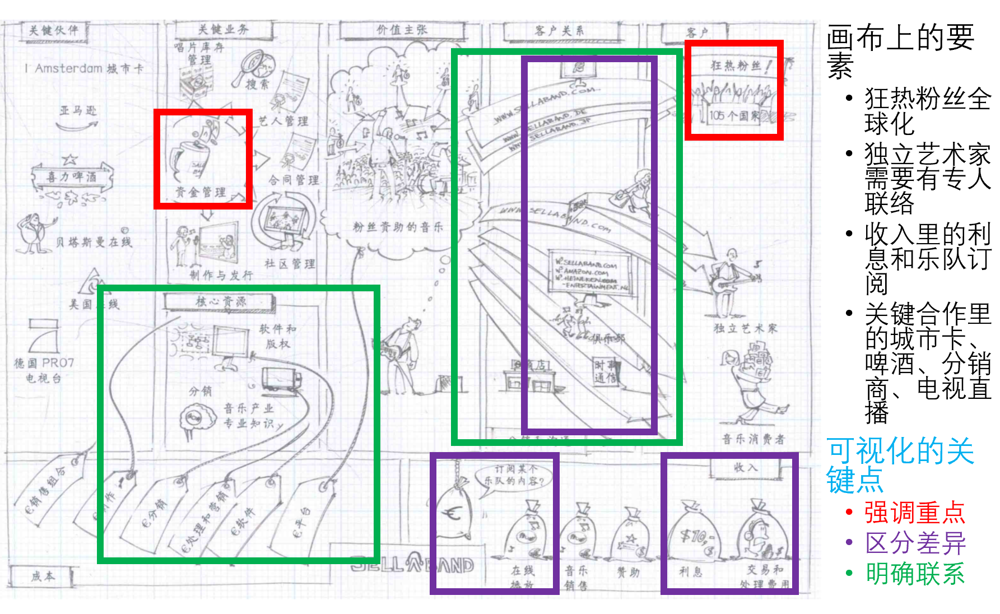

[TOC]

## 作业内容：两个视频

- 可视化讲述你们组大作业提交的商业模式画布，视频时长不超过8分钟

- 形成可视化故事时所有组员在场的讨论花絮，视频时长不超过5分钟

## 作业要求与安排

- 故事讲述方式：本ppt第19页，教材149页
  - 

- 视频录制：ppt本身就可以录制，使用手机拍摄+便利签+手绘有加分

- 每个模块讲解时必须配合绘图，画布本身要体现出客户洞察和构思的改进，不要照抄之前的文档，组内一人发声即可，允许后期配音

- 讨论录制：zoom（你们已经很会画屏幕了）

- 最好所有人都露脸以证明全部参加，请选取讨论最热烈的五分钟

- 视频剪辑：最简单的剪辑工具 – win10 **“照片”**

## 作业提交与评分

- 教学立方里只需组长上传作业，视频上传位置：Menkor？B站？

- 这部分内容将作为后续大作业评分的基础，教学立方里只记录上交情况和视频位置

- 大量文字ppt+毫无感情的zoom只能得到最低的及格分；画布与故事越生动，讨论越热烈，内容越充实分数越高；图形和语音的表达请尽量清晰